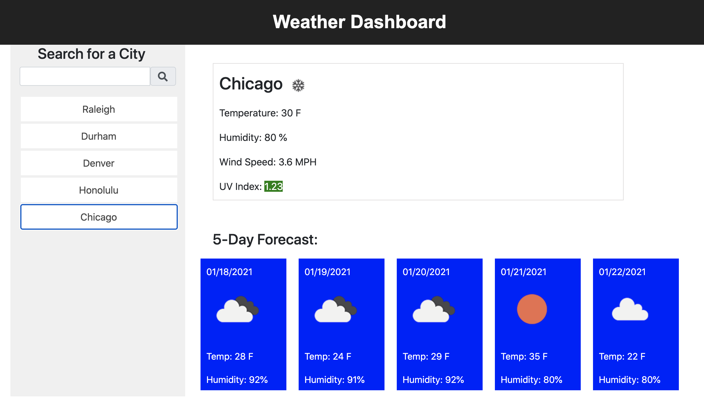

# weatherdashboard

## Description
This file allow you to enter in a city and show the weather with city name, icon, temperature, humidity, wind speed, and uv index.  It also will show a 5-day forecast for that city and create a button for each search.  If the page is reloaded, the last city search with pop up. 

## Link to Webpage
https://katemilano.github.io/weatherdashboard/

## Webpage Image 

## Contributors
Thanks to the instructors and teaching assistants at UNC Chapel Hill Bootcamp for making the creation of this webpage possible.

## Contact
If you have questions feel free to contact me at catherine.ann.milano@gmail.com.
